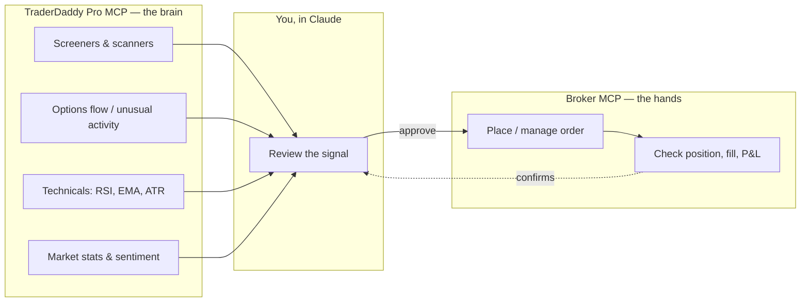

# The MCP trading ecosystem

TraderDaddy Pro is the **intelligence layer**: screeners, options flow, technicals,
market stats. It doesn't place trades. The pattern that makes it useful is pairing
it with a **broker MCP server** — something that *can* place trades — and letting
Claude be the bridge between the two.

TraderDaddy Pro never touches your broker credentials and a broker MCP never touches
market-scanning logic. Each side is a separate `claude mcp add` — Claude is the only
thing that sees both.

## Example flow

1. Ask Claude: *"Any unusual options activity in the SPX complex today?"* → TraderDaddy
   Pro's `get_unusual_options_activity` returns a flagged ticker.
2. Ask Claude to pull technicals on it (`get_technical_indicators`) to sanity-check the
   entry.
3. If it holds up, tell Claude to place the trade — that call goes to whichever broker
   MCP you have connected (Tradier, Robinhood, IBKR, ...), not to TraderDaddy Pro.
4. Confirm the fill — either back through the broker MCP, or by asking TraderDaddy Pro
   for updated market context on the position.

## Multiple brokers, one Claude session

Nothing stops you from connecting more than one broker MCP alongside TraderDaddy Pro —
e.g. Tradier for equities and Coinbase for crypto in the same session. Claude routes
each trade call to the right server based on what you ask for. See
[**awesome-broker-mcp**](https://github.com/mphinance/awesome-broker-mcp) for what's
currently connectable and the per-broker setup detail.

## Read-only aggregators are a different shape

Aggregators like SnapTrade plug into *many* brokers through one hosted MCP endpoint,
but (as of this writing) they're read-only: portfolio/position visibility across
accounts, no order placement. Useful for a single "what do I hold everywhere" view
feeding into TraderDaddy Pro's analysis — not a substitute for a broker's own
trading-capable MCP. The
[aggregator section](https://github.com/mphinance/awesome-broker-mcp#aggregators) of
awesome-broker-mcp covers the ones researched, and the one trading-capable exception.
