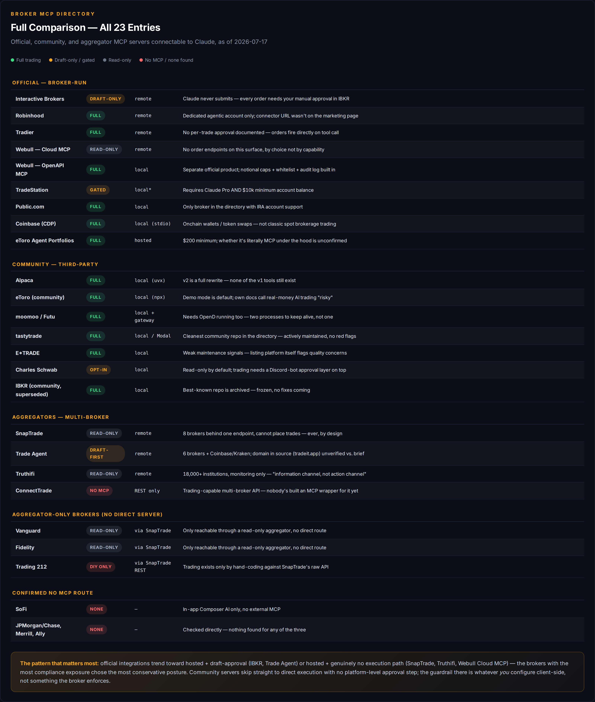

# Broker MCP directory

What's connectable to Claude for actual order execution, alongside TraderDaddy Pro.
See [`../ECOSYSTEM.md`](../ECOSYSTEM.md) for how the two layers fit together.
Aggregators (multi-broker connectors) live in [`../aggregators/`](../aggregators/).

Status legend: **official** (first-party, run/hosted by the broker) · **community**
(third-party repo, not endorsed by the broker) · **aggregator-only** (no direct
server, reachable only via SnapTrade/Truthifi) · **none** (confirmed no MCP route
exists).

## Official

| Broker | Trading | Server type | Source |
|---|---|---|---|
| [Interactive Brokers](interactive-brokers.md) | global markets, multi-asset (draft-only, you submit) | remote (hosted) | [claude.com/connectors](https://claude.com/connectors/interactive-brokers) |
| [Robinhood](robinhood.md) | stocks, options, futures (per docs) | remote (hosted) | [robinhood.com](https://robinhood.com/us/en/agentic-trading/) |
| [Tradier](tradier.md) | equities + multi-leg options | remote (hosted) | [docs.tradier.com](https://docs.tradier.com/docs/tradier-mcp) |
| [Webull](webull.md) | Cloud MCP (hosted) read-only; `webull-openapi-mcp` (local) full trading incl. options/futures/crypto | remote + local, both official | [github.com/webull-inc](https://github.com/webull-inc/webull-openapi-mcp) |
| [TradeStation](tradestation.md) | equities + more (Claude Pro + $10k balance required) | local (unconfirmed) | [tradestation.com](https://www.tradestation.com/platforms-and-tools/mcp/) |
| [Public.com](public.md) | stocks, ETF, options, crypto, brokerage + IRA | local | [public.com](https://public.com/api/docs/templates/claude-desktop-mcp) |
| [Coinbase](coinbase.md) | onchain wallets/token swaps (not classic spot trading) | local (stdio) | [docs.cdp.coinbase.com](https://docs.cdp.coinbase.com/get-started/tools/cdp-cli-mcp) |
| [eToro](etoro.md) — official half | Agent Portfolios (dedicated portfolio, $200 min) | hosted (eToro-managed) | [etoro.com](https://www.etoro.com/news-and-analysis/etoro-updates/agent-portfolios-let-your-ai-agent-trade-for-you/) |

## Community

| Broker | Trading | Server type | Source |
|---|---|---|---|
| [Alpaca](alpaca.md) | stocks, ETF, crypto, options, fixed income, indices | local (`uvx`) | [github.com/alpacahq](https://github.com/alpacahq/alpaca-mcp-server) |
| [eToro](etoro.md) — community half | 35 tools, positions/orders on your own account | local (`npx`) | [github.com/gabrielcerutti](https://github.com/gabrielcerutti/etoro-mcp-server) |
| [moomoo / Futu](moomoo.md) | full order execution (real by explicit unlock) | local + OpenD gateway | [github.com/Litash](https://github.com/Litash/moomoo-api-mcp) |
| [tastytrade](tastytrade.md) | equities, options, futures, multi-leg | local or Modal-hosted | [github.com/ferdousbhai](https://github.com/ferdousbhai/tasty-agent) |
| [E*TRADE](etrade.md) | full order placement + risk validation | local (weak maintenance signals) | [glama.ai](https://glama.ai/mcp/servers/@davdunc/mcp_etrade) |
| [Charles Schwab](schwab.md) | equities, options, brackets/OCO (opt-in + Discord approval) | local | [github.com/jkoelker](https://github.com/jkoelker/schwab-mcp) |
| [Interactive Brokers](interactive-brokers.md) — superseded community options | varies by repo | local | see IBKR page |

## Aggregator-only (no direct server)

| Broker | Trading | Route |
|---|---|---|
| [Vanguard](vanguard.md) | none | SnapTrade / Truthifi (read-only) |
| [Fidelity](fidelity.md) | none | SnapTrade / Truthifi (read-only) |
| [Trading 212](trading212.md) | via raw SnapTrade REST API only, not MCP | SnapTrade (read-only MCP; trading needs a DIY wrapper) |

## Confirmed no MCP route

Checked, no server found — not "unknown," confirmed negative:

- **SoFi** — in-app Composer AI only, no external MCP.
- **JP Morgan / Chase, Merrill (BofA), Ally Invest** — none found.

## Local process vs. remote connector

Matters for what runs where and what you have to keep alive:

- **Remote / hosted** — connect via Claude's connector marketplace or paste a URL,
  done. IBKR (official), Robinhood, Tradier, Webull Cloud MCP (read-only), eToro
  Agent Portfolios, SnapTrade, Trade Agent, Truthifi.
- **Local server / gateway required** — a process has to be running on your machine.
  TradeStation, Public.com, Coinbase (stdio), Alpaca (`uvx`), community eToro
  (`npx`), moomoo (needs OpenD — two processes), tastytrade (local or Modal),
  E*TRADE, Schwab, the superseded IBKR community servers, Webull's
  `webull-openapi-mcp` (the trading-capable one).

## Still pending / unvetted

Not yet built: EU/UK brokers (Trade Republic, Fineco, Hargreaves Lansdown), Zerodha
(Kite Connect community server), IG (read-only), ThinkMarkets, Deriv, cTrader/Spotware,
TraderEvolution.
